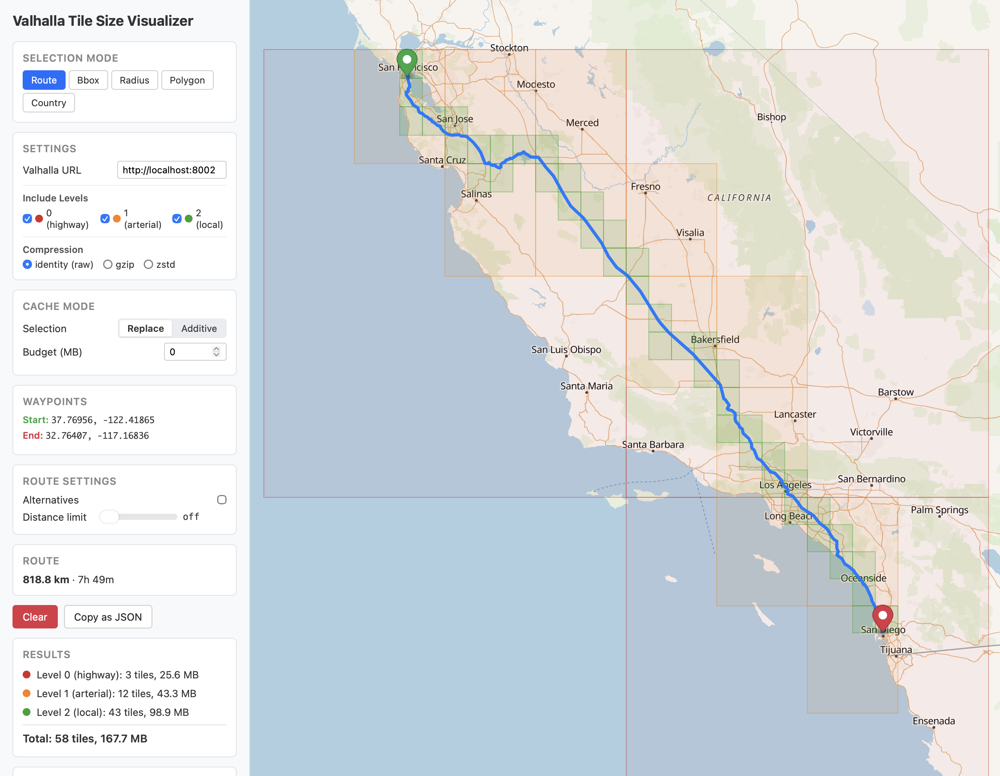

# Valhalla Tile Size Visualizer

Visualize [Valhalla](https://github.com/valhalla/valhalla) graph tile sizes on a map. Draw a bounding box, polygon, country, or route, and see how many bytes each tile would take to download — useful for estimating offline map footprints and predictive prefetch budgets.

The tool is a small [axum](https://github.com/tokio-rs/axum) server that proxies tile size requests to a [rati](https://github.com/valhalla/rati) instance and caches results in memory. The frontend is a single MapLibre HTML page served by the same process.



## Usage

```
$ ./valhalla-size-viz --help
Usage: valhalla-size-viz [OPTIONS] --rati-url <RATI_URL>

Options:
      --port <PORT>                Port to listen on [default: 3000]
      --concurrency <CONCURRENCY>  Max concurrent upstream fetches to rati [default: 32]
      --rati-url <RATI_URL>        rati base URL (e.g. http://localhost:8050) [env: RATI_URL=]
  -h, --help                       Print help
  -V, --version                    Print version
```

The UI exposes three transfer encodings to measure:

- **identity** — raw on-wire bytes, no compression
- **gzip** — broadly supported, browser-friendly
- **zstd** — best compression ratio, what rati prefers when both are accepted

## Build & Run

```sh
cargo run --release -- --rati-url http://localhost:8050
```

Then open <http://localhost:3000> in a browser.

## Docker

```sh
docker run --rm -p 3000:3000 kinkard/valhalla-size-viz:latest \
  --rati-url http://host.docker.internal:8050
```

The published image on Docker Hub is currently `linux/arm64` only. On `amd64` hosts, build the image locally:

```sh
docker build -t valhalla-size-viz .
docker run --rm -p 3000:3000 valhalla-size-viz --rati-url http://host.docker.internal:8050
```

## License

Dual-licensed under [Apache-2.0](LICENSE-APACHE) or [MIT](LICENSE-MIT) at your option.
